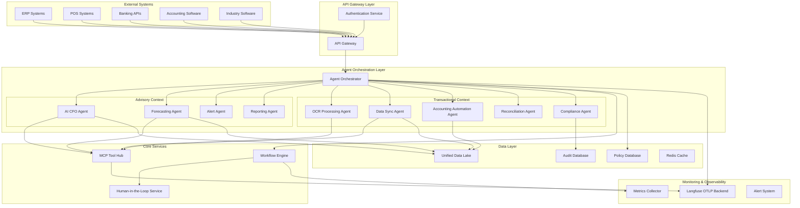

# Design Document

## Overview

The AI Financial Multi-Agent System is designed as a unified platform with two bounded contexts following the "one platform - two bounded contexts" model. The system shares data, policies, and audit capabilities while orchestrating independently for Advisory and Transactional workflows. Built on LangChain/LangGraph foundations, it provides comprehensive financial automation for SMBs with deep ecosystem integration.

### Key Design Principles

- **Unified Platform Architecture**: Single platform serving two distinct bounded contexts
- **Agent-First Design**: Each domain handled by specialized agents with clear responsibilities  
- **Event-Driven Architecture**: Asynchronous processing with streaming capabilities
- **Observability by Design**: Complete tracing and monitoring across all services
- **Security and Compliance**: Built-in guardrails, HITL controls, and audit trails

## Architecture

### High-Level System Architecture



### Agent Core Architecture

Based on LangChain and LangGraph frameworks with the following capabilities:

- **Streaming Events**: Both synchronous and asynchronous event streaming
- **MCP Integration**: Client support for internal and external tools
- **OpenTelemetry Tracing**: Multi-service distributed tracing
- **Database Connectivity**: Support for SQL and NoSQL databases
- **Async Processing**: Celery, Kafka, or RabbitMQ for background tasks

## Components and Interfaces

### 1. Agent Orchestrator

**Purpose**: Central coordination of all agents and workflow management

**Key Responsibilities**:
- Route requests to appropriate agents based on context
- Manage inter-agent communication
- Handle workflow state management
- Coordinate between Advisory and Transactional contexts

**Interfaces**:
- REST API for external system integration
- WebSocket for real-time streaming
- Message queue for async processing

### 2. Advisory Context Agents

#### AI CFO Agent
**Purpose**: Industry-specific financial advisory and analysis

**Capabilities**:
- Industry-specific financial insights (healthcare, automotive, pharmaceutical)
- Integration with multiple data sources for comprehensive analysis
- Natural language financial advisory
- Risk assessment and opportunity identification

#### Forecasting Agent
**Purpose**: Financial forecasting and scenario planning

**Capabilities**:
- 13-week cash flow forecasting
- 12-month P&L projections
- What-if scenario modeling
- Trend analysis and pattern recognition

#### Alert Agent
**Purpose**: Proactive risk and opportunity detection

**Capabilities**:
- Real-time financial health monitoring
- Threshold-based alerting
- Quantified risk assessment
- Automated notification delivery

#### Reporting Agent
**Purpose**: Executive reporting and documentation

**Capabilities**:
- Executive brief generation
- Citation and source documentation
- Board-ready report formatting
- Multi-format output (PDF, dashboard, email)

### 3. Transactional Context Agents

#### OCR Processing Agent
**Purpose**: Document processing and data extraction

**Capabilities**:
- Receipt and invoice OCR processing
- Automatic data extraction and validation
- Confidence scoring and quality assessment
- Integration with accounting systems for entry creation

#### Data Sync Agent
**Purpose**: Multi-source data integration and synchronization

**Capabilities**:
- Bidirectional sync with ERP, POS, banking systems
- Data standardization and mapping
- Conflict resolution and error handling
- Real-time and batch processing modes

#### Accounting Automation Agent
**Purpose**: Automated accounting entry and processing

**Capabilities**:
- Automated journal entry creation
- P2P/AP/Opex processing
- Expense categorization and validation
- Integration with accounting standards

#### Reconciliation Agent
**Purpose**: Bank and system reconciliation

**Capabilities**:
- Automated bank statement reconciliation
- ERP data matching and validation
- Discrepancy identification and resolution
- Month-end closing acceleration

#### Compliance Agent
**Purpose**: Regulatory compliance and audit support

**Capabilities**:
- Policy enforcement and validation
- Audit trail maintenance
- Regulatory reporting
- Compliance monitoring and alerting

### 4. MCP Tool Hub

**Purpose**: Centralized tool repository following MCP Server standards

**Tool Categories**:
- **Memory Tools**: Save to memory, retrieval, context management
- **Integration Tools**: API connectors for external systems
- **Processing Tools**: Data transformation, validation, calculation
- **Communication Tools**: Email, SMS, webhook notifications
- **Analysis Tools**: Financial calculations, statistical analysis

**MCP Server Implementation**:
- Standardized tool registration and discovery
- Consistent interface across all tools
- Error handling and fallback mechanisms
- Performance monitoring and optimization

### 5. Human-in-the-Loop (HITL) Service

**Purpose**: Workflow approval and human oversight

**Capabilities**:
- Two-man rule implementation
- Policy limit enforcement
- Budget control and approval workflows
- Exception handling and escalation

**Workflow Types**:
- Transaction approval workflows
- Policy exception handling
- High-value transaction reviews
- Compliance violation responses

## Data Models

### Core Financial Entities

```python
# Transaction Model
class Transaction:
    id: str
    amount: Decimal
    currency: str
    date: datetime
    type: TransactionType  # INCOME, EXPENSE, TRANSFER
    category: str
    description: str
    source_system: str
    confidence_score: float
    status: TransactionStatus
    metadata: Dict[str, Any]

# Account Model
class Account:
    id: str
    name: str
    type: AccountType  # ASSET, LIABILITY, EQUITY, REVENUE, EXPENSE
    balance: Decimal
    currency: str
    external_id: str
    source_system: str
    last_sync: datetime

# Invoice Model
class Invoice:
    id: str
    invoice_number: str
    amount: Decimal
    currency: str
    issue_date: datetime
    due_date: datetime
    customer_id: str
    status: InvoiceStatus
    line_items: List[InvoiceLineItem]
    payment_terms: int  # days
    confidence_score: float

# Forecast Model
class Forecast:
    id: str
    type: ForecastType  # CASH_FLOW, PL, BALANCE_SHEET
    period_start: datetime
    period_end: datetime
    predictions: List[ForecastPrediction]
    confidence_interval: float
    methodology: str
    created_at: datetime
```

### Agent State Models

```python
# Agent Execution Context
class AgentContext:
    agent_id: str
    session_id: str
    user_id: str
    company_id: str
    permissions: List[str]
    state: Dict[str, Any]
    trace_id: str

# Workflow State
class WorkflowState:
    workflow_id: str
    current_step: str
    steps_completed: List[str]
    pending_approvals: List[ApprovalRequest]
    data: Dict[str, Any]
    created_at: datetime
    updated_at: datetime
```

### Integration Models

```python
# External System Connection
class ExternalSystem:
    id: str
    name: str
    type: SystemType  # ERP, POS, BANK, ACCOUNTING
    connection_config: Dict[str, Any]
    sync_frequency: str
    last_sync: datetime
    status: ConnectionStatus

# Data Mapping Configuration
class DataMapping:
    source_system: str
    target_system: str
    field_mappings: Dict[str, str]
    transformation_rules: List[TransformationRule]
    validation_rules: List[ValidationRule]
```

## Error Handling

### Error Classification

1. **System Errors**: Infrastructure, network, database connectivity issues
2. **Integration Errors**: External system API failures, authentication issues
3. **Data Errors**: Validation failures, format issues, missing required fields
4. **Business Logic Errors**: Policy violations, compliance issues, workflow failures
5. **Agent Errors**: LLM failures, tool execution errors, timeout issues

### Error Handling Strategy

```python
class ErrorHandler:
    def handle_error(self, error: Exception, context: AgentContext) -> ErrorResponse:
        # Classify error type
        error_type = self.classify_error(error)
        
        # Apply appropriate handling strategy
        if error_type == ErrorType.TRANSIENT:
            return self.retry_with_backoff(error, context)
        elif error_type == ErrorType.DATA_QUALITY:
            return self.route_to_human_review(error, context)
        elif error_type == ErrorType.SYSTEM:
            return self.escalate_to_ops(error, context)
        else:
            return self.log_and_continue(error, context)
```

### Recovery Mechanisms

- **Automatic Retry**: Exponential backoff for transient failures
- **Circuit Breaker**: Prevent cascade failures in external integrations
- **Graceful Degradation**: Fallback to manual processes when automation fails
- **Human Escalation**: Route complex issues to human operators
- **State Recovery**: Restore workflow state after system recovery

## Testing Strategy

### Unit Testing
- Individual agent logic testing
- Tool functionality validation
- Data model validation
- Error handling verification

### Integration Testing
- Agent-to-agent communication
- External system integration
- Database connectivity
- MCP tool integration

### End-to-End Testing
- Complete workflow execution
- Advisory flow testing (data sync → analysis → forecasting → alerting → reporting)
- Transactional flow testing (OCR → standardization → accounting → reconciliation → audit)
- Cross-context interaction testing

### Performance Testing
- Load testing for concurrent agent execution
- Stress testing for high transaction volumes
- Latency testing for real-time operations
- Scalability testing for growing data volumes

### Security Testing
- Authentication and authorization testing
- Data encryption validation
- Audit trail verification
- Compliance requirement validation

## Deployment Architecture

### Containerized Microservices
- Each agent deployed as independent container
- Kubernetes orchestration for scaling and management
- Service mesh for inter-service communication
- Load balancing and health checks

### Data Storage Strategy
- **Operational Data**: PostgreSQL for transactional consistency
- **Analytics Data**: ClickHouse for time-series and analytical queries
- **Document Storage**: MongoDB for unstructured data (OCR results, reports)
- **Cache Layer**: Redis for session state and frequently accessed data
- **Message Queue**: Apache Kafka for event streaming

### Monitoring and Observability
- **Distributed Tracing**: OpenTelemetry with Jaeger backend
- **Metrics Collection**: Prometheus with Grafana dashboards
- **Log Aggregation**: ELK stack (Elasticsearch, Logstash, Kibana)
- **LLM Monitoring**: Langfuse for prompt tracking and token usage
- **Alert Management**: PagerDuty integration for critical issues

### Security Implementation
- **API Security**: OAuth 2.0 with JWT tokens
- **Data Encryption**: AES-256 encryption at rest, TLS 1.3 in transit
- **Network Security**: VPC with private subnets, WAF protection
- **Secrets Management**: HashiCorp Vault for API keys and credentials
- **Audit Logging**: Immutable audit logs with digital signatures