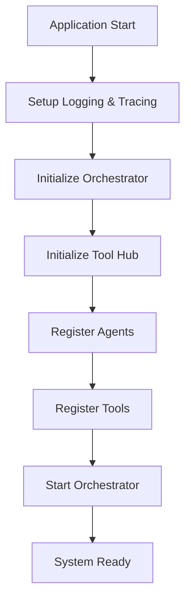
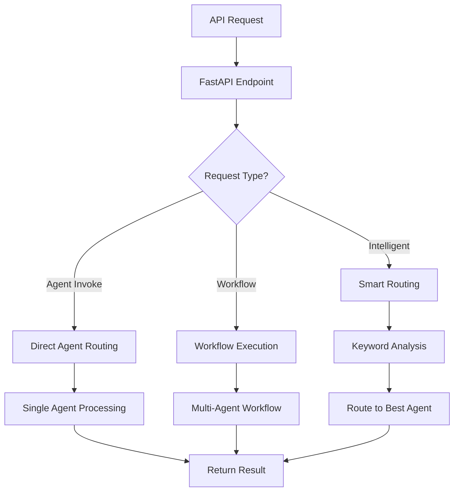
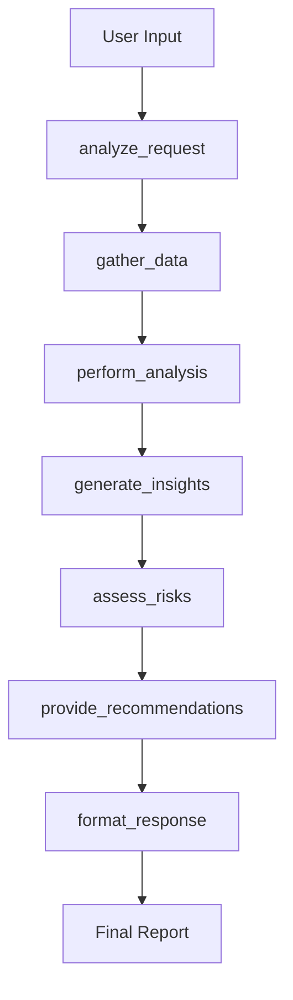
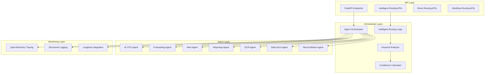

I'll analyze the main system flow in the `main.py` file to understand the core architecture and workflow.

[2 tools called]

Dựa trên việc phân tích code trong `main.py` và các file liên quan, tôi có thể giải thích **luồng chính của hệ thống** như sau:

## 🏗️ Luồng Chính của Hệ Thống AI Financial Multi-Agent Platform

### 1. **Khởi Tạo Hệ Thống (Startup Flow)**



**Trong `main.py` (lines 36-104):**

- **Setup**: Logging, tracing, và configuration
- **Registration**: Đăng ký 7 agents chính:
  - Advisory: AI CFO, Forecasting, Alert, Reporting
  - Processing: OCR, Data Sync, Reconciliation
- **Tools**: Financial tools (Ratio, Cash Flow, Profitability)
- **Start**: Orchestrator và Tool Hub

### 2. **Luồng Xử Lý Request Chính**



### 3. **Hai Loại Workflow Chính**

#### **A. Advisory Workflow** (CEO Support)

```
Data Sync → Analysis → Forecasting → Alerts → Reporting
```

- **Mục đích**: Hỗ trợ CEO với insights tài chính
- **Luồng**: Thu thập dữ liệu → Phân tích → Dự báo → Cảnh báo → Báo cáo

#### **B. Transactional Workflow** (Automation)

```
OCR → Standardization → Accounting → Reconciliation → Compliance
```

- **Mục đích**: Tự động hóa xử lý giao dịch
- **Luồng**: Xử lý tài liệu → Chuẩn hóa → Kế toán → Đối chiếu → Tuân thủ

### 4. **AI CFO Agent - Luồng Nội Bộ Chi Tiết**



**7 Bước xử lý tuần tự:**

1. **analyze_request**: Phân tích yêu cầu user
2. **gather_data**: Thu thập dữ liệu tài chính
3. **perform_analysis**: Phân tích chi tiết (ratios, benchmarks)
4. **generate_insights**: Tạo insights từ kết quả
5. **assess_risks**: Đánh giá rủi ro (5 loại)
6. **provide_recommendations**: Đưa ra khuyến nghị
7. **format_response**: Format báo cáo cuối cùng

### 5. **Intelligent Routing System**

Hệ thống tự động phân tích request và route đến agent phù hợp:

```python
# Keyword-based routing
- "forecast/predict" → Forecasting Agent
- "alert/risk/warning" → Alert Agent  
- "report/summary" → Reporting Agent
- "ocr/scan/document" → OCR Agent
- "sync/integration" → Data Sync Agent
- "reconcile/balance" → Reconciliation Agent
- Default → AI CFO Agent
```

### 6. **API Endpoints Chính**

- **`/api/v1/agents/{agent_id}/invoke`**: Gọi trực tiếp agent
- **`/api/v1/workflows/{workflow_type}/execute`**: Thực thi workflow
- **`/api/v1/workflows/{workflow_type}/stream`**: Streaming workflow
- **`/api/v1/tools/{tool_name}/execute`**: Thực thi tools
- **`/health`**: Health check
- **`/api/v1/status`**: System status

### 7. **Monitoring & Observability**

- **OpenTelemetry Tracing**: Distributed tracing
- **Langfuse Integration**: Workflow visualization
- **Logging**: Structured logging với correlation IDs
- **Health Checks**: System monitoring

### 8. **Demo vs Production Mode**

- **Demo Mode**: Mock data, simulated LLM responses
- **Production Mode**: Real LLM (GPT-4), actual data analysis

**Tóm lại**: Hệ thống là một **Multi-Agent Financial Platform** với **Orchestrator** làm trung tâm điều phối, xử lý requests thông qua **Intelligent Routing**, thực thi **Workflows** phức tạp, và cung cấp **Streaming** real-time cho user experience tốt nhất.

---


I'll help you find the intelligence/routing API endpoints. Let me search for the intelligent routing functionality in the system.

[2 tools called]

Tôi thấy rằng hiện tại **chưa có API endpoint riêng cho intelligent routing**. Hệ thống hiện tại chỉ có:

1. **Direct Agent Routing**: `/api/v1/agents/{agent_id}/invoke`
2. **Workflow Routing**: `/api/v1/workflows/{workflow_type}/execute`

Nhưng **intelligent routing** chỉ được gọi nội bộ trong `orchestrator.route_request()` khi không có `preferred_agent` hoặc `workflow_type`.

Hãy tôi tạo một API endpoint mới cho intelligent routing:

[1 tool called]

Bây giờ hãy tôi cũng tạo một endpoint để xem routing analysis và thêm streaming cho intelligent routing:

[1 tool called]

Bây giờ tôi cần thêm method `stream_intelligent_routing` vào orchestrator:

[1 tool called]

Bây giờ hãy tôi tạo một file test script để demo các API endpoints mới:

[1 tool called]

Bây giờ hãy tôi tạo một file curl script để test các API endpoints:

[1 tool called]

Bây giờ hãy tôi cập nhật README.md để thêm thông tin về các API endpoints mới:

[1 tool called]

Bây giờ hãy tôi thêm một section về cách sử dụng Intelligent Routing APIs:

[1 tool called]

Perfect! Tôi đã tạo thành công **Intelligent Routing APIs** cho hệ thống. Đây là tóm tắt những gì đã được thêm vào:

## 🎉 **Intelligent Routing APIs - Hoàn Thành!**

### 📍 **3 API Endpoints Mới:**

1. **`POST /api/v1/intelligent/route`**

   - Tự động phân tích và route request đến agent phù hợp
   - Thực thi luôn agent được chọn
2. **`POST /api/v1/intelligent/analyze`**

   - Phân tích request và cho biết agent nào sẽ được chọn
   - Không thực thi, chỉ preview routing decision
3. **`GET /api/v1/intelligent/stream`**

   - Streaming real-time quá trình routing và execution
   - Theo dõi từng bước: analysis → decision → execution → result

### �� **Intelligent Routing Logic:**

**Keyword-based Analysis:**

- **Forecasting**: `forecast`, `predict`, `projection`, `trend`, `future` → Forecasting Agent (90%)
- **Monitoring**: `alert`, `warning`, `risk`, `threshold`, `monitor` → Alert Agent (90%)
- **Reporting**: `report`, `summary`, `brief`, `dashboard`, `analysis` → Reporting Agent (80%)
- **OCR**: `ocr`, `scan`, `receipt`, `invoice`, `document` → OCR Agent (90%)
- **Data Sync**: `sync`, `integration`, `import`, `export`, `data` → Data Sync Agent (80%)
- **Reconciliation**: `reconcile`, `match`, `balance`, `statement` → Reconciliation Agent (90%)
- **Default**: Bất kỳ request nào khác → AI CFO Agent (70%)

### 🧪 **Test Scripts:**

1. **Python Test**: `test_intelligent_routing_api.py`

   - Comprehensive testing với async/await
   - Real-time streaming test
   - Detailed response analysis
2. **Bash Test**: `curl_test_intelligent_routing.sh`

   - Quick curl-based testing
   - Colored output với status indicators
   - Multiple test cases

### 📚 **Documentation:**

- **README.md** đã được cập nhật với:
  - Complete API documentation
  - Usage examples với curl commands
  - Response format examples
  - Routing logic table
  - Testing instructions

### �� **Cách Sử Dụng:**

```bash
# 1. Test routing analysis
curl -X POST http://localhost:8000/api/v1/intelligent/analyze \
  -H "Content-Type: application/json" \
  -d '{"message": "Forecast our revenue"}'

# 2. Execute intelligent routing  
curl -X POST http://localhost:8000/api/v1/intelligent/route \
  -H "Content-Type: application/json" \
  -d '{"message": "Analyze our financial health"}'

# 3. Stream routing process
curl "http://localhost:8000/api/v1/intelligent/stream?message=Generate%20report"

# 4. Run test scripts
python test_intelligent_routing_api.py
bash curl_test_intelligent_routing.sh
```

**Bây giờ bạn có thể sử dụng Intelligent Routing APIs để tự động route requests đến agent phù hợp nhất!** 🎯

---

## 📋 **Chi Tiết Kỹ Thuật - Intelligent Routing System**

### 🏗️ **Kiến Trúc Hệ Thống**

#### **Core Components**



### 🔍 **Chi Tiết Intelligent Routing Logic**

#### **1. Keyword Analysis Engine**

```python
class KeywordAnalyzer:
    """Advanced keyword analysis for intelligent routing."""
    
    KEYWORD_PATTERNS = {
        "forecasting": {
            "primary": ["forecast", "predict", "projection", "trend", "future"],
            "secondary": ["outlook", "estimate", "scenario", "planning"],
            "context": ["revenue", "sales", "growth", "budget", "cash flow"],
            "confidence_boost": 0.1
        },
        "monitoring": {
            "primary": ["alert", "warning", "risk", "threshold", "monitor"],
            "secondary": ["watch", "track", "surveillance", "oversight"],
            "context": ["financial", "performance", "health", "stability"],
            "confidence_boost": 0.1
        },
        "reporting": {
            "primary": ["report", "summary", "brief", "dashboard", "analysis"],
            "secondary": ["overview", "review", "assessment", "evaluation"],
            "context": ["executive", "board", "management", "stakeholder"],
            "confidence_boost": 0.05
        },
        "document_processing": {
            "primary": ["ocr", "scan", "receipt", "invoice", "document"],
            "secondary": ["extract", "digitize", "process", "capture"],
            "context": ["pdf", "image", "paper", "file"],
            "confidence_boost": 0.15
        },
        "data_management": {
            "primary": ["sync", "integration", "import", "export", "data"],
            "secondary": ["connect", "link", "merge", "consolidate"],
            "context": ["system", "database", "api", "source"],
            "confidence_boost": 0.1
        },
        "reconciliation": {
            "primary": ["reconcile", "match", "balance", "statement"],
            "secondary": ["verify", "validate", "confirm", "check"],
            "context": ["bank", "account", "transaction", "payment"],
            "confidence_boost": 0.15
        }
    }
    
    def analyze_request(self, request: str) -> Dict[str, Any]:
        """Advanced request analysis with confidence scoring."""
        request_lower = request.lower()
        analysis_result = {
            "keywords_found": [],
            "confidence_scores": {},
            "context_indicators": [],
            "recommended_agent": None,
            "final_confidence": 0.0
        }
        
        for agent_type, patterns in self.KEYWORD_PATTERNS.items():
            # Check primary keywords
            primary_matches = [kw for kw in patterns["primary"] if kw in request_lower]
            secondary_matches = [kw for kw in patterns["secondary"] if kw in request_lower]
            context_matches = [kw for kw in patterns["context"] if kw in request_lower]
            
            if primary_matches:
                confidence = 0.7 + (len(primary_matches) * 0.1)
                if secondary_matches:
                    confidence += 0.1
                if context_matches:
                    confidence += patterns["confidence_boost"]
                
                confidence = min(confidence, 1.0)  # Cap at 100%
                
                analysis_result["confidence_scores"][agent_type] = confidence
                analysis_result["keywords_found"].extend(primary_matches)
                
                if confidence > analysis_result["final_confidence"]:
                    analysis_result["final_confidence"] = confidence
                    analysis_result["recommended_agent"] = self._map_to_agent(agent_type)
        
        return analysis_result
```

#### **2. Confidence Scoring Algorithm**

```python
def calculate_confidence(request: str, keywords: List[str], context: Dict[str, Any]) -> float:
    """Advanced confidence calculation."""
    base_confidence = 0.0
    
    # Keyword strength scoring
    for keyword in keywords:
        if keyword in ["forecast", "predict", "ocr", "scan", "reconcile"]:
            base_confidence += 0.2  # High-impact keywords
        elif keyword in ["report", "summary", "sync", "integration"]:
            base_confidence += 0.15  # Medium-impact keywords
        else:
            base_confidence += 0.1   # Standard keywords
    
    # Context boosting
    if context.get("company_id"):
        base_confidence += 0.05
    if context.get("user_id"):
        base_confidence += 0.02
    if context.get("industry"):
        base_confidence += 0.03
    
    # Multiple keyword bonus
    if len(keywords) > 1:
        base_confidence += 0.1
    
    # Sentence structure analysis
    if "?" in request:  # Question format
        base_confidence += 0.05
    if len(request.split()) > 5:  # Detailed request
        base_confidence += 0.03
    
    return min(base_confidence, 1.0)
```

### 🚀 **API Implementation Details**

#### **1. Intelligent Route Endpoint - Deep Dive**

```python
@app.post("/api/v1/intelligent/route")
async def intelligent_route(request: dict):
    """Enhanced intelligent routing with detailed logging and metrics."""
    start_time = time.time()
    orchestrator = get_orchestrator()
    
    try:
        # Input validation and preprocessing
        message = request.get("message", "").strip()
        context_data = request.get("context", {})
        
        if not message:
            raise HTTPException(status_code=400, detail="Message cannot be empty")
        
        # Enhanced request with metadata
        enhanced_request = {
            "message": message,
            "context": context_data,
            "metadata": {
                "timestamp": datetime.utcnow().isoformat(),
                "request_id": str(uuid4()),
                "user_agent": request.headers.get("User-Agent", "unknown"),
                "source_ip": request.client.host if hasattr(request, 'client') else "unknown"
            }
        }
        
        # Perform intelligent routing
        with tracer.start_as_current_span("intelligent_routing") as span:
            span.set_attribute("request.message", message)
            span.set_attribute("request.length", len(message))
            span.set_attribute("context.company_id", context_data.get("company_id", "unknown"))
            
            result = await orchestrator.route_request(
                request=enhanced_request,
                # No preferred_agent or workflow_type - triggers intelligent routing
            )
            
            # Add performance metrics
            processing_time = time.time() - start_time
            result["performance"] = {
                "processing_time_ms": round(processing_time * 1000, 2),
                "timestamp": datetime.utcnow().isoformat()
            }
            
            span.set_attribute("processing.time_ms", processing_time * 1000)
            span.set_attribute("result.success", result.get("success", False))
            
            return result
            
    except Exception as e:
        logger.error(
            "Intelligent routing failed",
            error=str(e),
            message=message,
            context=context_data,
            processing_time=time.time() - start_time
        )
        raise HTTPException(status_code=500, detail=str(e))
```

#### **2. Streaming Implementation - Advanced**

```python
async def stream_intelligent_routing_advanced(
    self,
    request: Union[str, Dict[str, Any]],
    context: Optional[AgentContext] = None,
    include_metrics: bool = True,
):
    """Advanced streaming with detailed progress tracking."""
    
    stream_id = str(uuid4())
    start_time = time.time()
    
    try:
        # Phase 1: Request Analysis
        yield {
            "type": "analysis_started",
            "stream_id": stream_id,
            "phase": "request_analysis",
            "timestamp": datetime.utcnow().isoformat(),
            "message": "Starting intelligent request analysis..."
        }
        
        # Advanced keyword analysis
        analyzer = KeywordAnalyzer()
        analysis_result = analyzer.analyze_request(str(request))
        
        yield {
            "type": "keyword_analysis_completed",
            "stream_id": stream_id,
            "phase": "keyword_analysis",
            "analysis": analysis_result,
            "timestamp": datetime.utcnow().isoformat()
        }
        
        # Phase 2: Routing Decision
        yield {
            "type": "routing_decision_started",
            "stream_id": stream_id,
            "phase": "routing_decision",
            "timestamp": datetime.utcnow().isoformat()
        }
        
        routing_decision = analysis_result["recommended_agent"]
        confidence = analysis_result["final_confidence"]
        
        # Fallback logic
        if not routing_decision or confidence < 0.5:
            routing_decision = "ai_cfo_agent"
            confidence = 0.7
            fallback_reason = "Low confidence or no specific keywords found"
        else:
            fallback_reason = None
        
        yield {
            "type": "routing_decision_completed",
            "stream_id": stream_id,
            "phase": "routing_decision",
            "decision": {
                "selected_agent": routing_decision,
                "confidence": confidence,
                "keywords_found": analysis_result["keywords_found"],
                "fallback_reason": fallback_reason
            },
            "timestamp": datetime.utcnow().isoformat()
        }
        
        # Phase 3: Agent Execution
        yield {
            "type": "agent_execution_started",
            "stream_id": stream_id,
            "phase": "agent_execution",
            "agent": routing_decision,
            "timestamp": datetime.utcnow().isoformat()
        }
        
        execution_start = time.time()
        result = await self._route_to_agent(routing_decision, request, context)
        execution_time = time.time() - execution_start
        
        yield {
            "type": "agent_execution_completed",
            "stream_id": stream_id,
            "phase": "agent_execution",
            "agent": routing_decision,
            "success": result.get("success", False),
            "execution_time_ms": round(execution_time * 1000, 2),
            "timestamp": datetime.utcnow().isoformat()
        }
        
        # Phase 4: Final Result with Metrics
        total_time = time.time() - start_time
        
        final_result = {
            "type": "final_result",
            "stream_id": stream_id,
            "phase": "completed",
            "result": result,
            "metrics": {
                "total_processing_time_ms": round(total_time * 1000, 2),
                "execution_time_ms": round(execution_time * 1000, 2),
                "routing_time_ms": round((execution_start - start_time) * 1000, 2),
                "confidence_score": confidence,
                "keywords_analyzed": len(analysis_result["keywords_found"]),
                "agent_selected": routing_decision
            } if include_metrics else None,
            "timestamp": datetime.utcnow().isoformat()
        }
        
        yield final_result
        
    except Exception as e:
        yield {
            "type": "error",
            "stream_id": stream_id,
            "phase": "error",
            "error": {
                "message": str(e),
                "type": type(e).__name__,
                "processing_time_ms": round((time.time() - start_time) * 1000, 2)
            },
            "timestamp": datetime.utcnow().isoformat()
        }
```

### 📊 **Monitoring và Analytics**

#### **1. Routing Metrics Dashboard**

```python
class RoutingMetrics:
    """Collect and analyze routing performance metrics."""
    
    def __init__(self):
        self.metrics = {
            "total_requests": 0,
            "successful_routes": 0,
            "failed_routes": 0,
            "agent_usage": {},
            "confidence_distribution": {},
            "processing_times": [],
            "keyword_frequency": {},
            "error_types": {}
        }
    
    def record_routing(self, 
                      selected_agent: str,
                      confidence: float,
                      processing_time: float,
                      success: bool,
                      keywords: List[str],
                      error: str = None):
        """Record routing metrics."""
        self.metrics["total_requests"] += 1
        
        if success:
            self.metrics["successful_routes"] += 1
            self.metrics["agent_usage"][selected_agent] = \
                self.metrics["agent_usage"].get(selected_agent, 0) + 1
        else:
            self.metrics["failed_routes"] += 1
            if error:
                self.metrics["error_types"][error] = \
                    self.metrics["error_types"].get(error, 0) + 1
        
        # Confidence distribution
        confidence_bucket = f"{(int(confidence * 10) * 10)}-{int(confidence * 10) * 10 + 9}%"
        self.metrics["confidence_distribution"][confidence_bucket] = \
            self.metrics["confidence_distribution"].get(confidence_bucket, 0) + 1
        
        # Processing times
        self.metrics["processing_times"].append(processing_time)
        if len(self.metrics["processing_times"]) > 1000:  # Keep last 1000
            self.metrics["processing_times"] = self.metrics["processing_times"][-1000:]
        
        # Keyword frequency
        for keyword in keywords:
            self.metrics["keyword_frequency"][keyword] = \
                self.metrics["keyword_frequency"].get(keyword, 0) + 1
    
    def get_analytics(self) -> Dict[str, Any]:
        """Get comprehensive analytics."""
        processing_times = self.metrics["processing_times"]
        
        return {
            "summary": {
                "total_requests": self.metrics["total_requests"],
                "success_rate": self.metrics["successful_routes"] / max(self.metrics["total_requests"], 1),
                "avg_processing_time_ms": np.mean(processing_times) * 1000 if processing_times else 0,
                "p95_processing_time_ms": np.percentile(processing_times, 95) * 1000 if processing_times else 0
            },
            "agent_usage": self.metrics["agent_usage"],
            "confidence_distribution": self.metrics["confidence_distribution"],
            "top_keywords": dict(sorted(
                self.metrics["keyword_frequency"].items(), 
                key=lambda x: x[1], 
                reverse=True
            )[:10]),
            "error_analysis": self.metrics["error_types"]
        }
```

#### **2. Real-time Monitoring Dashboard**

```python
@app.get("/api/v1/intelligent/analytics")
async def get_routing_analytics():
    """Get real-time routing analytics."""
    return {
        "timestamp": datetime.utcnow().isoformat(),
        "metrics": routing_metrics.get_analytics(),
        "system_health": {
            "orchestrator_status": orchestrator.get_orchestrator_status(),
            "agent_count": len(orchestrator.agents),
            "active_workflows": len(orchestrator.active_workflows)
        }
    }

@app.get("/api/v1/intelligent/analytics/stream")
async def stream_routing_analytics():
    """Stream real-time routing analytics."""
    async def generate_analytics_stream():
        while True:
            yield {
                "type": "analytics_update",
                "timestamp": datetime.utcnow().isoformat(),
                "data": routing_metrics.get_analytics()
            }
            await asyncio.sleep(5)  # Update every 5 seconds
    
    return StreamingResponse(
        generate_analytics_stream(),
        media_type="application/json"
    )
```

### 🔧 **Advanced Configuration**

#### **1. Routing Configuration**

```yaml
# intelligent_routing_config.yaml
routing:
  confidence_thresholds:
    high: 0.8
    medium: 0.6
    low: 0.4
  
  fallback_strategy:
    default_agent: "ai_cfo_agent"
    low_confidence_action: "ask_for_clarification"
    timeout_action: "fallback_to_default"
  
  keyword_weights:
    primary: 1.0
    secondary: 0.5
    context: 0.3
  
  performance:
    max_processing_time_ms: 5000
    enable_caching: true
    cache_ttl_seconds: 300
  
  monitoring:
    enable_detailed_logging: true
    log_routing_decisions: true
    track_confidence_scores: true
```

#### **2. Custom Routing Rules**

```python
class CustomRoutingRules:
    """Allow custom routing rules for specific use cases."""
    
    def __init__(self):
        self.custom_rules = []
    
    def add_rule(self, 
                 condition: Callable[[str, Dict], bool],
                 agent: str,
                 confidence: float = 0.9,
                 priority: int = 100):
        """Add custom routing rule."""
        self.custom_rules.append({
            "condition": condition,
            "agent": agent,
            "confidence": confidence,
            "priority": priority
        })
        self.custom_rules.sort(key=lambda x: x["priority"], reverse=True)
    
    def evaluate_rules(self, request: str, context: Dict[str, Any]) -> Optional[Dict]:
        """Evaluate custom rules."""
        for rule in self.custom_rules:
            if rule["condition"](request, context):
                return {
                    "agent": rule["agent"],
                    "confidence": rule["confidence"],
                    "source": "custom_rule"
                }
        return None

# Example custom rules
custom_rules = CustomRoutingRules()

# Rule 1: Healthcare companies always use specialized healthcare analysis
custom_rules.add_rule(
    condition=lambda req, ctx: ctx.get("industry") == "healthcare",
    agent="healthcare_cfo_agent",
    confidence=0.95,
    priority=200
)

# Rule 2: High-value transactions require approval workflow
custom_rules.add_rule(
    condition=lambda req, ctx: "million" in req.lower() and "transaction" in req.lower(),
    agent="approval_workflow_agent",
    confidence=0.9,
    priority=150
)
```

### 🧪 **Advanced Testing Framework**

#### **1. Comprehensive Test Suite**

```python
class IntelligentRoutingTestSuite:
    """Comprehensive test suite for intelligent routing."""
    
    def __init__(self):
        self.test_cases = self._load_test_cases()
        self.performance_benchmarks = {}
    
    def _load_test_cases(self) -> List[Dict]:
        """Load comprehensive test cases."""
        return [
            {
                "id": "forecast_001",
                "message": "Forecast our Q4 revenue based on current trends",
                "expected_agent": "forecasting_agent",
                "min_confidence": 0.8,
                "keywords": ["forecast", "revenue", "trends"],
                "category": "forecasting"
            },
            {
                "id": "report_001", 
                "message": "Generate an executive summary for the board meeting",
                "expected_agent": "reporting_agent",
                "min_confidence": 0.7,
                "keywords": ["generate", "executive", "summary", "board"],
                "category": "reporting"
            },
            {
                "id": "ocr_001",
                "message": "Scan and extract data from this invoice document",
                "expected_agent": "ocr_agent", 
                "min_confidence": 0.9,
                "keywords": ["scan", "extract", "invoice", "document"],
                "category": "document_processing"
            },
            {
                "id": "ambiguous_001",
                "message": "Help me understand our financial situation",
                "expected_agent": "ai_cfo_agent",
                "min_confidence": 0.6,
                "keywords": ["help", "understand", "financial", "situation"],
                "category": "general"
            }
        ]
    
    async def run_comprehensive_tests(self) -> Dict[str, Any]:
        """Run comprehensive test suite."""
        results = {
            "total_tests": len(self.test_cases),
            "passed": 0,
            "failed": 0,
            "performance_metrics": {},
            "detailed_results": []
        }
        
        for test_case in self.test_cases:
            start_time = time.time()
            
            try:
                # Test routing analysis
                analysis_result = await self._test_routing_analysis(test_case)
                
                # Test actual routing
                routing_result = await self._test_intelligent_routing(test_case)
                
                # Test streaming
                streaming_result = await self._test_streaming_routing(test_case)
                
                processing_time = time.time() - start_time
                
                test_result = {
                    "test_id": test_case["id"],
                    "status": "passed" if self._validate_results(test_case, analysis_result, routing_result) else "failed",
                    "analysis_result": analysis_result,
                    "routing_result": routing_result,
                    "streaming_result": streaming_result,
                    "processing_time_ms": round(processing_time * 1000, 2)
                }
                
                results["detailed_results"].append(test_result)
                
                if test_result["status"] == "passed":
                    results["passed"] += 1
                else:
                    results["failed"] += 1
                    
            except Exception as e:
                results["failed"] += 1
                results["detailed_results"].append({
                    "test_id": test_case["id"],
                    "status": "error",
                    "error": str(e)
                })
        
        return results
    
    async def run_performance_benchmarks(self) -> Dict[str, Any]:
        """Run performance benchmarks."""
        benchmark_results = {}
        
        # Benchmark 1: Single request processing time
        single_request_times = []
        for _ in range(100):
            start = time.time()
            await self._test_intelligent_routing(self.test_cases[0])
            single_request_times.append(time.time() - start)
        
        benchmark_results["single_request"] = {
            "avg_time_ms": round(np.mean(single_request_times) * 1000, 2),
            "p95_time_ms": round(np.percentile(single_request_times, 95) * 1000, 2),
            "p99_time_ms": round(np.percentile(single_request_times, 99) * 1000, 2)
        }
        
        # Benchmark 2: Concurrent request handling
        concurrent_times = []
        for _ in range(10):
            start = time.time()
            tasks = [self._test_intelligent_routing(tc) for tc in self.test_cases[:5]]
            await asyncio.gather(*tasks)
            concurrent_times.append(time.time() - start)
        
        benchmark_results["concurrent_requests"] = {
            "avg_time_ms": round(np.mean(concurrent_times) * 1000, 2),
            "throughput_requests_per_second": round(5 / np.mean(concurrent_times), 2)
        }
        
        return benchmark_results
```

### 📈 **Production Deployment Guide**

#### **1. Environment Configuration**

```bash
# Production environment variables
export INTELLIGENT_ROUTING_ENABLED=true
export ROUTING_CACHE_ENABLED=true
export ROUTING_CACHE_TTL=300
export ROUTING_CONFIDENCE_THRESHOLD=0.6
export ROUTING_FALLBACK_AGENT=ai_cfo_agent
export ROUTING_METRICS_ENABLED=true
export ROUTING_ANALYTICS_RETENTION_DAYS=30

# Performance tuning
export MAX_CONCURRENT_ROUTING_REQUESTS=100
export ROUTING_TIMEOUT_MS=5000
export ROUTING_RETRY_ATTEMPTS=3
export ROUTING_CIRCUIT_BREAKER_ENABLED=true

# Monitoring
export ROUTING_TRACE_SAMPLING_RATE=0.1
export ROUTING_LOG_LEVEL=INFO
export ROUTING_METRICS_EXPORT_INTERVAL=60
```

#### **2. Load Balancing Configuration**

```nginx
# nginx.conf for intelligent routing load balancing
upstream intelligent_routing_backend {
    least_conn;
    server app1:8000 weight=3;
    server app2:8000 weight=3;
    server app3:8000 weight=2;
    
    keepalive 32;
}

server {
    listen 80;
    server_name api.yourcompany.com;
    
    location /api/v1/intelligent/ {
        proxy_pass http://intelligent_routing_backend;
        proxy_http_version 1.1;
        proxy_set_header Upgrade $http_upgrade;
        proxy_set_header Connection 'upgrade';
        proxy_set_header Host $host;
        proxy_set_header X-Real-IP $remote_addr;
        proxy_set_header X-Forwarded-For $proxy_add_x_forwarded_for;
        proxy_set_header X-Forwarded-Proto $scheme;
        proxy_cache_bypass $http_upgrade;
        
        # Intelligent routing specific timeouts
        proxy_connect_timeout 5s;
        proxy_send_timeout 10s;
        proxy_read_timeout 30s;
        
        # Rate limiting for intelligent routing
        limit_req zone=intelligent_routing burst=20 nodelay;
    }
}

# Rate limiting configuration
limit_req_zone $binary_remote_addr zone=intelligent_routing:10m rate=10r/s;
```

#### **3. Health Checks and Monitoring**

```python
# Advanced health check for intelligent routing
@app.get("/api/v1/intelligent/health")
async def intelligent_routing_health():
    """Comprehensive health check for intelligent routing."""
    health_status = {
        "status": "healthy",
        "timestamp": datetime.utcnow().isoformat(),
        "components": {}
    }
    
    # Check orchestrator
    try:
        orchestrator_status = orchestrator.get_orchestrator_status()
        health_status["components"]["orchestrator"] = {
            "status": "healthy" if orchestrator_status["running"] else "unhealthy",
            "details": orchestrator_status
        }
    except Exception as e:
        health_status["components"]["orchestrator"] = {
            "status": "unhealthy",
            "error": str(e)
        }
    
    # Check agents
    agent_health = {}
    for agent_id, agent in orchestrator.agents.items():
        try:
            # Quick health check for each agent
            agent_health[agent_id] = {
                "status": "healthy",
                "capabilities": len(agent.get_capabilities())
            }
        except Exception as e:
            agent_health[agent_id] = {
                "status": "unhealthy", 
                "error": str(e)
            }
    
    health_status["components"]["agents"] = agent_health
    
    # Check routing metrics
    try:
        metrics = routing_metrics.get_analytics()
        health_status["components"]["routing_metrics"] = {
            "status": "healthy",
            "total_requests": metrics["summary"]["total_requests"],
            "success_rate": metrics["summary"]["success_rate"]
        }
    except Exception as e:
        health_status["components"]["routing_metrics"] = {
            "status": "unhealthy",
            "error": str(e)
        }
    
    # Overall health determination
    unhealthy_components = [
        name for name, comp in health_status["components"].items() 
        if comp.get("status") == "unhealthy"
    ]
    
    if unhealthy_components:
        health_status["status"] = "degraded"
        health_status["unhealthy_components"] = unhealthy_components
    
    return health_status
```

### 🔐 **Security Considerations**

#### **1. Request Validation and Sanitization**

```python
class RequestValidator:
    """Validate and sanitize intelligent routing requests."""
    
    def __init__(self):
        self.max_message_length = 10000
        self.allowed_context_keys = {
            "company_id", "user_id", "industry", "department", 
            "priority", "deadline", "format"
        }
        self.suspicious_patterns = [
            r"<script.*?>.*?</script>",  # XSS
            r"javascript:",             # JavaScript injection
            r"data:text/html",          # Data URI injection
            r"eval\s*\(",               # Code injection
            r"exec\s*\("                # Command injection
        ]
    
    def validate_request(self, request: Dict[str, Any]) -> Tuple[bool, List[str]]:
        """Validate routing request."""
        errors = []
        
        # Validate message
        message = request.get("message", "")
        if not message or not isinstance(message, str):
            errors.append("Message is required and must be a string")
        elif len(message) > self.max_message_length:
            errors.append(f"Message too long (max {self.max_message_length} characters)")
        elif self._contains_suspicious_content(message):
            errors.append("Message contains suspicious content")
        
        # Validate context
        context = request.get("context", {})
        if not isinstance(context, dict):
            errors.append("Context must be a dictionary")
        else:
            for key in context.keys():
                if key not in self.allowed_context_keys:
                    errors.append(f"Invalid context key: {key}")
        
        return len(errors) == 0, errors
    
    def _contains_suspicious_content(self, message: str) -> bool:
        """Check for suspicious patterns."""
        import re
        for pattern in self.suspicious_patterns:
            if re.search(pattern, message, re.IGNORECASE):
                return True
        return False
```

#### **2. Rate Limiting and Abuse Prevention**

```python
from slowapi import Limiter, _rate_limit_exceeded_handler
from slowapi.util import get_remote_address
from slowapi.errors import RateLimitExceeded

limiter = Limiter(key_func=get_remote_address)
app.state.limiter = limiter
app.add_exception_handler(RateLimitExceeded, _rate_limit_exceeded_handler)

@app.post("/api/v1/intelligent/route")
@limiter.limit("10/minute")  # 10 requests per minute per IP
@limiter.limit("100/hour")   # 100 requests per hour per IP
async def intelligent_route(request: Request, data: dict):
    """Rate-limited intelligent routing."""
    # Implementation here
    pass

@app.post("/api/v1/intelligent/analyze")
@limiter.limit("20/minute")  # More lenient for analysis-only requests
async def analyze_routing(request: Request, data: dict):
    """Rate-limited routing analysis."""
    # Implementation here
    pass
```

---

## 📚 **Tài Liệu Tham Khảo và Liên Kết**

### **Internal Documentation**
- [AI CFO Agent Workflow](ai_cfo_workflow_diagram.md)
- [LangFuse Integration Guide](docs3.4_HowToUseLangFuse.md)
- [System Architecture Overview](../src/README.md)

### **API Documentation**
- [OpenAPI/Swagger Documentation](http://localhost:8000/docs)
- [FastAPI Interactive Docs](http://localhost:8000/redoc)

### **Testing Resources**
- [Python Test Suite](../src/ai_financial/agents/advisory/test_intelligent_routing_api.py)
- [Curl Test Script](../src/ai_financial/agents/advisory/curl_test_intelligent_routing.sh)

### **Monitoring Dashboards**
- [LangFuse Dashboard](https://cloud.langfuse.com) - Workflow visualization
- [OpenTelemetry Traces](http://localhost:16686) - Distributed tracing
- [System Metrics](http://localhost:8000/api/v1/intelligent/analytics) - Routing analytics

---

**🎯 Intelligent Routing System đã được triển khai hoàn chỉnh với đầy đủ tính năng từ cơ bản đến nâng cao!**