# AI CFO Agent Workflow Visualization - LangFuse

## Workflow Overview

This diagram shows the internal workflow of the AI CFO Agent using LangGraph.

```mermaid

graph TD
    A["👤 User Input<br/>Financial Analysis Request"] --> B["🔍 analyze_request<br/>• Classify request type<br/>• Determine analysis scope<br/>• Create analysis plan"]
    
    B --> C["📊 gather_data<br/>• Load transactions<br/>• Get account data<br/>• Fetch invoices<br/>• Industry benchmarks"]
    
    C --> D["🧮 perform_analysis<br/>• Liquidity analysis<br/>• Profitability analysis<br/>• Efficiency analysis<br/>• Leverage analysis"]
    
    D --> E["💡 generate_insights<br/>• LLM-powered insights<br/>• Strengths & weaknesses<br/>• Trend identification<br/>• Industry comparison"]
    
    E --> F["⚠️ assess_risks<br/>• Liquidity risk<br/>• Credit risk<br/>• Operational risk<br/>• Market risk<br/>• Compliance risk"]
    
    F --> G["🎯 provide_recommendations<br/>• Immediate actions<br/>• Short-term initiatives<br/>• Long-term strategies<br/>• Success metrics"]
    
    G --> H["📝 format_response<br/>• Executive summary<br/>• Risk assessment<br/>• Recommendations<br/>• Industry context"]
    
    H --> I["📋 Final Report<br/>Comprehensive Financial Analysis"]
    
    %% Data flow annotations
    B -.->|"analysis_plan"| C
    C -.->|"financial_data"| D
    D -.->|"analysis_results"| E
    E -.->|"insights"| F
    F -.->|"risk_assessment"| G
    G -.->|"recommendations"| H
    H -.->|"formatted_report"| I
    
    %% Styling
    classDef inputNode fill:#e3f2fd,stroke:#0277bd,stroke-width:3px,color:#000
    classDef processNode fill:#f3e5f5,stroke:#7b1fa2,stroke-width:2px,color:#000
    classDef outputNode fill:#e8f5e8,stroke:#388e3c,stroke-width:3px,color:#000
    classDef dataFlow stroke:#ff9800,stroke-width:1px,stroke-dasharray: 5 5
    
    class A inputNode
    class B,C,D,E,F,G,H processNode
    class I outputNode

```



## Workflow Steps

### 1. analyze_request
- **Purpose**: Analyze and understand user request
- **Input**: User message (text)
- **Processing**: 
  - Classify analysis type needed
  - Determine industry context
  - Create analysis plan
- **Output**: Analysis plan in metadata

### 2. gather_data
- **Purpose**: Collect necessary financial data
- **Input**: Analysis plan from step 1
- **Processing**:
  - Load transactions, accounts, invoices
  - Create mock financial data (demo mode)
  - Prepare data for analysis
- **Output**: Financial data in metadata

### 3. perform_analysis
- **Purpose**: Perform detailed financial analysis
- **Input**: Financial data from step 2
- **Processing**:
  - Analyze liquidity, profitability, efficiency
  - Calculate financial ratios
  - Compare with industry benchmarks
- **Output**: Analysis results in metadata

### 4. generate_insights
- **Purpose**: Generate insights and findings from analysis
- **Input**: Analysis results from step 3
- **Processing**:
  - Use LLM to generate insights
  - Identify strengths and weaknesses
  - Provide trend analysis
- **Output**: Insights in metadata

### 5. assess_risks
- **Purpose**: Assess financial risks
- **Input**: Insights from step 4
- **Processing**:
  - Analyze various risk types (liquidity, credit, operational, market, compliance)
  - Assess risk levels
  - Propose mitigation actions
- **Output**: Risk assessment in metadata

### 6. provide_recommendations
- **Purpose**: Provide strategic recommendations
- **Input**: Insights and risk assessment from steps 4,5
- **Processing**:
  - Create strategic recommendations
  - Categorize by timeline (immediate, short-term, long-term)
  - Propose specific actions
- **Output**: Recommendations in metadata

### 7. format_response
- **Purpose**: Format final response
- **Input**: All metadata from previous steps
- **Processing**:
  - Create comprehensive financial report
  - Format as Markdown structure
  - Include Executive Summary, Risk Assessment, Recommendations
- **Output**: Final formatted response

## Data Flow

```
User Input (text) 
    ↓
analyze_request → analysis_plan
    ↓
gather_data → financial_data  
    ↓
perform_analysis → analysis_results
    ↓
generate_insights → insights
    ↓
assess_risks → risk_assessment
    ↓
provide_recommendations → recommendations
    ↓
format_response → final_report (Markdown)
```

## LangFuse Integration

### Setup LangFuse:
1. **Install LangFuse**: `pip install langfuse`
2. **Set up environment variables**:
   ```bash
   export LANGFUSE_PUBLIC_KEY="your_public_key"
   export LANGFUSE_SECRET_KEY="your_secret_key"
   export LANGFUSE_HOST="https://cloud.langfuse.com"
   ```
3. **Run the visualizer**: `python langfuse_visualizer.py`
4. **View in LangFuse UI**: Check the trace in your LangFuse dashboard

### Code Integration:
```python
from langfuse import Langfuse
from langfuse.langchain import CallbackHandler

langfuse = Langfuse()
handler = CallbackHandler()

# Thêm vào graph execution
result = await self.compiled_graph.ainvoke(
    initial_state, 
    config={"callbacks": [handler]}
)
```

## Features

- ✅ **Graph Visualization**: See workflow as interactive graph
- ✅ **Node Execution**: Run individual nodes separately
- ✅ **Trace Monitoring**: Track execution flow
- ✅ **Performance Metrics**: Measure timing for each step
- ✅ **Error Tracking**: Debug issues in workflow
- ✅ **Data Flow**: See how data flows between nodes

## Usage

```python
# Initialize visualizer
visualizer = AICFOLangFuseVisualizer()
await visualizer.initialize_agent("general")

# Test workflow with LangFuse
result = await visualizer.test_workflow_with_langfuse("Phân tích tài chính")

# Save diagram
visualizer.save_mermaid_diagram()
```

---
*Generated on 2025-09-20 09:59:03 UTC*
*AI CFO Agent LangFuse Visualizer - Tạo trong thư mục advisory/*
